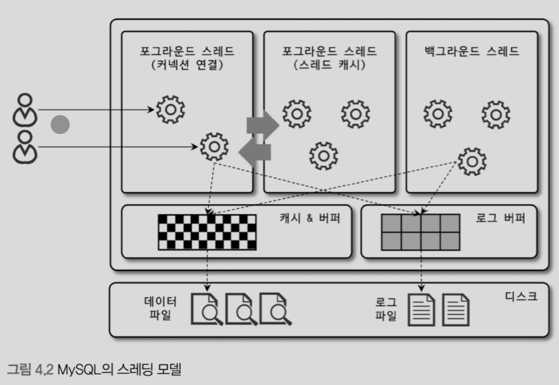

# 아키텍쳐


## MySQL 엔진
클라이언트로부터 접속 및 쿼리 요청을 처리하는 커넥션 핸들러, SQL 파서, 전처리기, 쿼리 옵티마이저가 중심을 이룬다. 

## 스토리지 엔진
MySQL 엔진은 요청을 분석, 최적화 하는 등의 처리를 하고 실제 데이터를 디스크 스토리지에 저장하거나 디스크 스토리지로부터 데이터를 읽어 오는 부분은 스토리지 엔진이 전담한다.
MySQL 엔진은 하나지만 스토리지 엔진은 여러 개를 동시에 사용할 수 있다.

## 핸들러 API
MySQL 엔진의 쿼리 실행기에서 데이터를 쓰거나 읽어야 할 때는 각 스토리지 엔진에 쓰기 또는 읽기를 요청하는데 이를 핸들러 요청이라고 한다.
여기서 사용되는 API를 핸들러 API라고 한다. InnoDB도 이 핸들러 API를 이용해서 MySQL 엔진과 데이터를 주고 받는다.

 `SHOW GLOBAL STATUS LIKE 'Handler%';`

| Variable\_name | Value |
| :--- | :--- |
| Handler\_commit | 614 |
| Handler\_delete | 8 |
| Handler\_discover | 0 |
| Handler\_external\_lock | 6421 |
| Handler\_mrr\_init | 0 |
| Handler\_prepare | 0 |
| Handler\_read\_first | 41 |
| Handler\_read\_key | 1760 |
| Handler\_read\_last | 0 |
| Handler\_read\_next | 4088 |

## MySQL 쓰레딩 구조


프로세스 기반이 아닌 쓰레드 기반으로 작동한다. 크게 포그라운드(Foreground), 백그라운드(Background) 쓰레드로 구분할 수 있다. 

### Foreground Thread(Client Thread)
포그라운드 쓰레드는 최소한 MySQL 서버에 접속된 클라이언트의 수만큼 존재한다. 주로 사용자가 요청하는 쿼리 문장을 처리한다. 클라이언트 사용자가 작업을 마치고 커넥션을 종료하면
해당 커넥션을 담당하던 쓰레드는 다시 쓰레드 캐시(ThreadCache)로 돌아간다. 만일 쓰레드 캐시에 일정 개수 이상의 대기 중인 쓰레드가 있으면 쓰레드 캐시에 넣지 않고
쓰레드를 종료시켜 일정 개수의 쓰레드만 쓰레드 캐시에 존재하게 한다. 이때 쓰레드 캐시에 유지할 수 있는 최대 쓰레드 개수는 `thread_cache_size` 시스템 변수로 설정한다.

포그라운드 쓰레드는 데이터를 MySQL의 데이터 버퍼나 캐시로부터 가져오며, 버퍼나 캐시에 없는 경우 직접 디스크의 데이터나 인덱스 파일로부터 데이터를 읽어와 처리한다. 
MyISAM은 디스크 쓰기까지 포그라운드가 처리하지만 InnoDB는 데이터 버퍼나 캐시까지만 포그라운드, 버퍼에서 디스크는 백그라운드 쓰레드가 처리한다.


### Background Thread
MyISAM은 해당 없다. InnoDB는 아래와 같은 경우가 백그라운드로 처리한다.
- insert buffer를 병합하는 쓰레드
- 로그를 디스크로 기록하는 쓰레드
- innoDB 버퍼 풀의 데이터를 디스크에 기록하는 쓰레드
- 데이터를 버퍼로 읽어 오는 쓰레드
- 잠금이나 데드락을 모니터링하는 쓰레드

가장 중요한 것은 로그 쓰레드(Log Thread)와 버퍼의 데이터를 디스크로 내려쓰는 작업을 처리하는 쓰기 쓰레드일 것이다.
데이터 쓰기, 데이터 읽기 쓰레드 수를 지정할 수 있다. (MySQL 5.5 이상) `innodb_write_io_threads`, `innodb_read_io_threads` 시스템 변수로 쓰레드 개수를 설정한다.
InnoDB에서 읽는 작업은 주로 클라이언트 쓰레드에서 처리되기 떄문에 읽기 쓰레드는 많이 설정할 필요가 없지만 쓰기 쓰레드는 대부분을 백그라운드로 처리하기 떄문에
디스크를 최적으로 사용할 수 있을 만큼 설정하는 것이 좋다. 

사용자 요청을 처리하는 중, 쓰기는 지연 처리할 수 있지만(버퍼링) 데이터 읽기는 지연될 수 없다. 그래서 상용 DBMS는 쓰기는 버퍼링해서 일괄처리하는 기능이 탑재되어 있으며, 
InnoDB 또한 이런 방식으로 처리한다. MyISAM은 사용자 쓰레드가 쓰기까지 처리한다. 그래서 실질 디스크 쓰기까지 기다려야 한다.

## 메모리 할당 및 사용 구조
MySQL 메모리 공간은 글로벌/ 로컬 영역으로 구분된다. 글로벌 메모리 영역의 모든 메모리 공간은 MySQL 서버가 시작되면서 운영체제로부터 할당된다.
글로벌 메모리 영역과 로컬 메모리 영역은 MySQL 서버 내에 존재하는 많은 쓰레드가 공유해서 사용하는 공간인지 여부에 따라 구분된다.

### 글로벌 메모리 영역
일반적으로 클라이언트 쓰레드의 수와 무관하게 하나의 메모리 공간만 할당된다. 생성된 글로벌 영역이 N개라고 해도 모든 쓰레드에 의해서 공유된다. 글로벌 메모리 영역은 대표적으로 다음과 같다.
- 테이블 캐시
- InnoDB 버퍼 풀
- InnoDB 어댑티브 해시 인덱스
- InnoDB 리두 로그 버퍼

### 로컬 메모리 영역
세션 메모리 영역이라고 표현하며 클라이언트 쓰레드가 쿼리를 처리하는데 사용하는 메모리 영역이다. 
- 정렬 버퍼
- 조인 버퍼
- 바이너리 로그 캐시
- 네트워크 버퍼

클라이언트 커넥션으로부터의 요청을 처리하기 위해 쓰레드를 하나씩 할당하게 되는데, 클라이언트 쓰레드가 사용하는 메모리 공간이라고 해서 클라이언트 메모리 영역이라고도 한다.
로컬 메모리는 각 클라이언트 쓰레드별로 독립적으로 할당되며 절대 공유되어 사용되지 않는다는 특징이있다. 또한, 로컬 메모리 공간은 각 쿼리의 용도별로 필요할 때만 공간이 할당되고
필요하지 않은 경우에는 MySQL이 메모리 공간을 할당조차 하지 않을 수도 있다. 예를 들어 정렬 버퍼, 조인 버퍼와 같은 공간이 그러하다.
로컬 메모리 공간은 커넥션이 열려 있는 동안 계속 할당된 상태로 남아 있는 공간도 있고( 커넥션 버퍼, 결과 버퍼 ) 그렇지 않고 쿼리를 실행하는 순간에만 할당했다가
다시 해제하는 공간( 정렬 버퍼, 조인 버퍼 )도 있다.


## 플러그인 스토리지 엔진 모델
MySQL에서는 플로그인 모델을 사용할 수 있다. 플러그인해서 사용할 수 있는 것은 스토리지 엔진만이 아니다. 스토리지 엔진 이외에도 부가적인 기능을 커스터마이징 해서 사용할 수 있다.
MySQL 플러그인을 사용한다고 해도 대부분의 작업이 MySQL 엔진에서 처리되고, 마지막 '데이터 읽기/쓰기' 작업만 스토리지 엔진에 의해 처리된다. (일부분의 기능만 실행된다.)

`SHOW ENGINES;`

| Engine | Support | Comment | Transactions | XA | Savepoints |
| :--- | :--- | :--- | :--- | :--- | :--- |
| ndbcluster | NO | Clustered, fault-tolerant tables | NULL | NULL | NULL |
| FEDERATED | NO | Federated MySQL storage engine | NULL | NULL | NULL |
| MEMORY | YES | Hash based, stored in memory, useful for temporary tables | NO | NO | NO |
| InnoDB | DEFAULT | Supports transactions, row-level locking, and foreign keys | YES | YES | YES |
| PERFORMANCE\_SCHEMA | YES | Performance Schema | NO | NO | NO |
| MyISAM | YES | MyISAM storage engine | NO | NO | NO |
| ndbinfo | NO | MySQL Cluster system information storage engine | NULL | NULL | NULL |
| MRG\_MYISAM | YES | Collection of identical MyISAM tables | NO | NO | NO |
| BLACKHOLE | YES | /dev/null storage engine \(anything you write to it disappears\) | NO | NO | NO |
| CSV | YES | CSV storage engine | NO | NO | NO |

Support 컬럼
- YES : MySQL 서버에 해당 스토리지 엔진이 포함되어 있고, 사용 가능으로 활성화된 상태
- DEFAULT : YES와 같지만 필수 스토리지 엔진이다. (이 엔진이 없으면 MySQL이 작동하지 않을 수도 있다.)
- NO : 현재 mysqld에 포함되어 있지 않다.
- DISABLED : mysqld에 있지만 파라미터에 의해 비활성됨

No를 사용하려면 MySQL 서버를 다시 빌드해야 한다. 물론 준비만 되어 있다면 플러그인 형태로 빌드된 스토리지 엔진 라이브러리를 끼워넣기만 해도 사용할 수 있다.


`SHOW PLUGINS;`

| Name | Status | Type | Library | License |
| :--- | :--- | :--- | :--- | :--- |
| binlog | ACTIVE | STORAGE ENGINE | NULL | GPL |
| mysql\_native\_password | ACTIVE | AUTHENTICATION | NULL | GPL |
| sha256\_password | ACTIVE | AUTHENTICATION | NULL | GPL |
| caching\_sha2\_password | ACTIVE | AUTHENTICATION | NULL | GPL |
| sha2\_cache\_cleaner | ACTIVE | AUDIT | NULL | GPL |
| daemon\_keyring\_proxy\_plugin | ACTIVE | DAEMON | NULL | GPL |
| CSV | ACTIVE | STORAGE ENGINE | NULL | GPL |
| MEMORY | ACTIVE | STORAGE ENGINE | NULL | GPL |
| InnoDB | ACTIVE | STORAGE ENGINE | NULL | GPL |
| INNODB\_TRX | ACTIVE | INFORMATION SCHEMA | NULL | GPL |

## 컴포넌트
MySQL 8.0부터는 플러그인 아키텍처를 컴포넌트가 아키텍처가 대체한다. 컴포넌트는 플러그인의 단점을 보완해서 구현했다.

- 플러그인은 오직 MySQL 서버와 인터페이스할 수 있고, 플러그인끼리는 통신할 수 없다. 
- 플러그인은 MySQL 서버의 변수나 함수를 직접 호출하기 떄문에 안전하지 않다.(캠슐화가 안 됨)
- 플러그인은 상호 의존 관계를 설정할 수 없어 초기화가 어렵다.


## 쿼리 실행 구조
### 쿼리 파서
쿼리 파서는 사용자 요청이 들어온 쿼리 문장을 토큰(MySQL이 인식할 수 있는 최소 단위의 어휘나 기호)로 분리해 트리 형태의 구조로 만들어 내는 작업을 의미한다. 
쿼리 문장의 기본 문법 오류는 이 과정에서 발견되고, 사용자에게 오류 메시지를 던진다.

### 전처리기
파서 과정에서 만들어진 파서 트리를 기반으로 쿼리 문장에 구조적인 문제점이 있는지 확인한다. 각 토큰을 테이블 이름이나 컬럼 이름, 또는 내장 함수와 같은
개체를 매핑해 해당 객체 존재 여부와 객체의 접근 권한 등을 확인하는 과정을 수행한다. 실제 존재하지 않거나 권한상 사용할 수 없는 개체의 토큰은 이 단계에서 걸러진다. 

### 옵티마이저
사용자 요청을 저렴한 비용으로 가장 빠르게 처리할수 있도록 최적하는 역할을 담당한다.

### 실행 엔진
옵티마이저가 두뇌라면 실행 엔진과 핸들러는 손과 발(실무자)에 비유할 수 있다. 옵티마이저가 `GROUP BY`를 처리하기 위해서 임시 테이블을 사용하기로 결정했다고 해보자.
1. 실행 엔진이 핸들러에게 임시 테이블을 만들라고 요청
2. 실행 엔진은 WHERE 절에 일치하는 레코드를 읽어오라고 핸들러에게 요청
3. 읽어온 레코드들을 1번에서 준비한 임시테이블이 저장하라고 핸들러에 요청
4. 데이터가 준비된 임시 테이블에서 필요한 방식으로 데이터를 읽어오라고 핸들러에게 다시 요청
5. 최종적으로 실행 엔진은 결과를 사용자나 다른 모듈로 넘김

### 핸들러(스토리지 엔진)
MySQL 실행 엔진의 요청에 따라 데이터를 디스크로 저장하고 디스크로부터 읽어 오는 역할을 담당한다. 핸들러는 결국 스토리지 엔진을 의미하며, MyISAM  테이블을 조작하면 핸들러가
MyISAM, InnoDB 테이블은 핸들러가 InnoDB 스토리지 엔진이 된다. 


## 복제
MySQL에서 Replication은 매우 중요한 역할을 담당한다. 

## 쿼리 캐시
MySQL에서 QueryCache는 빠른 응답을 필요로하는 웹 기반의 응용프로그램에서 중요한 역할을 담당했다. 쿼리 캐시는 SQL 실행 결과를 메모리에 캐시하고, 동일 SQL 쿼리가
실행되면 테이블을 읽지 않고 즉시 겨로가를 반환하기 떄문에 매우 빠른 성능을 보였다. 그러나 캐시된 내용 중 변경된 내용들이 포함되어 있는 경우 invalidate해야 했다. 
이는 심각한 동시 처리 성능 저하를 유발한다. 이런 이유로 MySQL 8.0에서는 QueryCache가 제거됐다.

## 쓰레드 풀
Enterprise는 ThreadPool을 제공한다. 쓰레드 풀은 내부적으로 사용자의 요청을 처리하는 쓰레드 개수를 줄여서 동시 처리되는 요청이 많다고 하더라도 MySQL 서버의 CPU가 제한된 개수의
쓰레드 처리에만 집중할 수 있게 해서 자원 소모를 줄이는 것이 목적이다. 쓰레드 풀이 만능은 아니다. 쓰레드 풀은 동시에 실행 중인 쓰레드들을 CPU가 최대한 잘 처리할 수 있는 정도로
줄여서 빨리 처리하도록 하는 기능이기 때문에 스케쥴링 과정에서 CPU 시간을 확보하지 못하면 쿼리 자체가 더 느려질 수도 있다. 물론 제한된 수의 쓰레드만으로 CPU가 처리되도록 하면
CPU 프로세서 진화도를 높이고 OS입장에서도 contextSwitch를 줄여서 오버헤드를 낮출 수 있다. 

일반적으로 CPU 코어 개수와 풀 개수를 맞추는 식으로 진행한다. MySQL 서버가 처리해야할 요청이 생기면 쓰레드 풀로 처리를 이관하는데, 만약 이미 쓰레드 풀이 처리 중인 
작업이 있으면 thread_pool_oversubscribe (default : 3)만큼 더 받아서 처리한다(큐의 개념)
...

## 트랜잭션 지원 메타데이터
DB 서버에서 테이블의 구조 정보와 스토어드 프로그램 등의 정보를 데이터 딕셔너리 또는 메타데이터라고 하는데, 5.7까지는 테이블 구조를 FRM에 저장하고 일부 스토어드 프로그램 또한 (.TRN, .TRG, .PAR )
기반으로 관리했다. 하지만 이런 파일 기반의 메타데이터는 생성, 변경 작업이 트랜잭션을 지원하지 않기 때문에 생성, 변경 중 MySQL 서버가 비정상 종료되면 일관되지 않은 상태로 
남는 문제가 있었다. ('데이터베이스나 테이블이 깨졌다.'라고 표현한다.)

MySQL 8.0 부터는 테이블 구조 정보나 스토어드 프로그램의 코드 관련 정보를 InnoDB 테이블에 저장하도록 변경됐다. 이런 테이블을 시스템 테이블이라고 한다. 시스템 테이블과 데이터
딕셔너리 정보를 모두 모아서 mysql DB에 저장하고 있다. mysql DB는 통째로 mysql.ibd라는 테이블 스페이스에 저장한다. 그래서 MySQL 서버의 데이터 디렉토리에 존재하는
mysql.ibd는 다른 .ibd와 함께 주의해야 한다.

MyISAM이나 CSV 등과 같은 스토리지 엔진의 메타 정보는 여전히 저장할 공간이 필요하다. MySQL 서버는 InnoDB 스토리지 엔진 이외의 스토리지 엔진을 사용하는
테이블들을 위해서 SDI(Serialized Dictionary Information) 파일을 사용한다. InnoDB 이외 테이블들에 대해서 SDI 포맷의 *.sdi가 존재하며 *.FRM과 동일한 역할을 한다.
또한 SDI 이름 그대로 직렬화를 위한 포맷이므로 InnoDB 테이블들의 구조도 SDI 파일로 변환할 수 있다.


## InnoDB 스토리지 엔진 아키텍쳐
InnoDB는 MySQL에서 사용할 수 있느 ㄴ스토피지 엔진 중 거의 유일하게 레코드 기반의 잠금을 제공하며, 그 때문에 높은 동시성 처리가 가능하고 안정적이며
성능이 뛰어나다. 

## PK에 의한 클러스터링
InnoDB의 모든 테이블은 기본적으로 PK를 기준으로 클러스터링되어 저장된다. 즉, PK 값 순서대로 디스크에 저장된다는 뜻이다. 모든 세컨더리 인덱스는 레코드 주소 대신 
PK 값을 논리적인 주소로 사용한다. PK가 클러스터링 인덱스이기 때문에 PK를 사용한 레인지 스캔은 상당히 빨리 처리될 수 있다. 
결과적으로 PK는 기본적으로 다른 보조 인덱스에 비해 비중이 높게 설정된다. 

## FK 지원
FK에 대한 지원은 InnoDB 스토리지 엔진 레벨에서 지원하는 기능으로 MyISAM이나 MEMORY 테이블에서는 사용할 수 없다.
InnoDB에서 외래 키는 부모 테이블과 자식 테이블 모두 해당 컬럼에 인덱스 생성이 필요하고, 변경 시에는 반드시 부모 테이블이나 자식 테이블에 데이터가 있는지 체크하는 
작업이 필요하므로, 잠금이 여러 테이블로 전파되고, 그로 인해 데드락이 발생할 수도 있다.

수동으로 데이터를 적재하거나 스키마 변경 등 급하게 해야하는 작업이 FK 제약으로 실패한다면 `foreign_key_checks` 시스템 변수를 OFF로 하면 체크 작업을 일시적으로
멈출 수 있다.

FK 체크를 일시적으로 해제했다고 해도 부모 - 자식 관계가 깨진 상태로 유지해도 된다는 것은 아니다. 반드시 부모 - 자식 일관성을 맞추고 다시 FK 제약을 활성화 해야한다.
`foreign_key_chekcs`를 비활성화하면 (ON DELETE CASCADE, ON UPDATE CASCADE)를 무시한다.


## MVCC(Multi Version Concurrency Control)
일반적으로 레코드 레벨의 트랜잭션을 지원하는 DBMS가 제공하는 기능이며 MVCC의 가장 큰 목적은 잠금을 사용하지 않는 일관된 읽기를 제공하는 것이다. InnoDB는
undo log를 이용해서 이 기능을 구현한다. 여기서 멀티 버전이라고 함은 하나의 레코드에 대해 여러 개의 버전이 동시에 관리된다는 의미이다.

## 잠금 없는 일관된 읽기 (Non-Locking Consistent Read)
InnoDB 스토리지 엔진은 MVCC를 이용해서 잠금 없이 읽기 작업을 한다. 잠금을 걸지 않기 때문에 InnoDB에서 읽기 작업은 다른 트랜잭션이 가지고 있는 잠금을 기다리지 않고
읽기 작업이 가능하다. SERIALIZABLE이 아니라면 INSERT와 연결되지 않는 한, SELECT는 다른 트랜잭션의 변경 작업과 관계업이 항상 잠금을 대기하지 않고 실행한다. 


## 자동 데드락 감지
InnoDB는 내부적으로 잠금이 교착 상태에 빠지지 않았는지 체크하기 위해 잠금 대기 목록을 그래프(Wait-for List) 형태로 관리한다. 
InnoDB 스토리지 엔진은 데드락 감지 쓰레드를 가지고 있어서데드락 감지 쓰레드가 주기적으로 잠금 대기 그래프를 검사해서 교착 상태에 빠진 트랜잭션들을 찾아서 그 중 
하나를 종료한다. 이때 어느 트랜잭션을 종료할지는 언두 로그 양으로 판단한다. 언두가 적은 것이 롤백 대상이 된다.

추가로 InnoDB 상위 엔진은 테이블 잠금을 볼 수 없는데 innodb_table_locks 변수를 활성화하면 테이블 레벨의 잠금까지 감지할 수 있다.
일반적으로 크게 문제가 되지 않지만 동시 처리 쓰레드가 너무 많아지거나 각 트랜잭션이 가진 잠금의 개수가 많아지면 데드락 감지 쓰레드가 느려진다. 데드락 감지 쓰레드는
잠금 목록을 검사해야 하기 때문에 잠금 상태가 변경되지 않도록 잠금 테이블에 새로운 잠금을 걸고 데드락 쓰레드를 찾는다. 데드락 감지 쓰레드가 느려지면 서비스 
쿼리를 처리 중인 쓰레드는 더는 작업을 진행을 진행하지 못하고 대기하면서 서비스에 악영향을 미치게 된다.

이런 문제점 해결을 위해 MySQL 서버는 innodb_deadlock_detext 시스템 변수를 제공하며 OFF로 지정하면 데드락 감지 쓰레드는 작동하지 않는다.
OFF로 두면 스토리지 엔진 내부에서 2개 이상의 트랜잭션이 상대방이 가진 잠금을 요구하는 상황(데드락)이 발생하면 무한정 대기하게 될 것이다.
`innodb_lock_wait_timeout`을 설정하면 일정 시간이 지나면 자동으로 요청이 실패하고 에러 메시지를 반환하게 된다. 

## 자동화된 장애 복구
InnoDB는 손실이나 장애로부터 보호하기 위한 여러 장치가 있다. 그런 매커니즘을 이용해서 MySQL 서버가 시작될 때 완료되지 못한 트랜잭션이나 디스크에 일부만 기록된
(Partial Write) 데이터 페이지 등에 대한 일련의 복구 작업이 자동으로 진행된다.

InnoDB 스토리지 엔진의 신뢰도는 꽤나 높다. 그러나 디스크, 서버 하드웨어 이슈로 InnoDB 스토리지 엔진이 자동 복구에 실패하는 경우도 있을 수 있는데, 이런 경우 
영구적 손실로 이어질 가능성이 높다. 이렇게 복구할 수 없을 정도의 손상이 있다면 자동 복구를 멈추고 MySQL서버는 종료돼 버린다.

이떄는 `innodb_force_recovery` 시스템 변수를 설정해서 MySQL를 실행해야 한다. 이 설정 값은 MySQL 서버가 시작될 때 InnoDB 스토리지 엔진이
데이터 파일이나 로그 파일의 손상 여부 검사를 선별적으로 진행할 수 있게 한다.

- innoDB 로그 파일이 손상됐다면 6
- innoDB 테이블이 깨졌다면 1

이 숫자 값이 커질수록 그만큼 심각한 상황이라 손실 가능성이 커지고, 복구 가능성은 줄어든다. 
일단 MySQL 서버가 기동되고 InnoDB 테이블이 인식되면 mysqldump를 이용해서 데이터를 가능한 만큼 백업하고 그 데이터로 MySQL 서버와 DB 테이블을 다시 생성하는 것이 좋다. 

### `innodb_force_recovery` 옵션
- 1 (SRV_FORCE_IGNORE_CORRUPT) : innoDB의 테이블 스페이스, 인덱스 페이지에서 손상된 부분이 발견돼도 무시하고 시작한다.
- 2 (SRV_FORCE_NO_BACKGROUND) : innoDB는 쿼리 처리를 위해서 여러 종류의 백그라운드 쓰레드를 동시에 사용한다. 이 복구 모드는 백그라운드 쓰레드 가운데,
메인 쓰레드를 시작하지 않고 MySQL를 시작한다. innoDB는 트랜잭션의 롤백을 위해서 언두 데이터를 관리하는데, 트랜잭션이 커밋되어 불필요한 언두 데이터는 innoDB 메인 쓰레드가 purge한다. 
메인 쓰레드가 언두 데이터를 삭제하는 과정에서 장애가 발생한다면 이 모드를 사용하면 된다.
- 3 (SRV_FORCE_NO_TRX_UNDO) : innoDB에서 트랜잭션이 실행되면 롤백에 대비해서 변경 전 데이터를 언두 영역에 기록한다. MySQL를 실행하면 서버는 재기동하면서 언두 영역의 데이터를 먼저
데이터 파일에 적용하고 그다음 리두 내용을 다시 덮어서 장애 시점의 데이터 상태를 만든다. 그리고 정상적인 MySQL 서버의 시작에서는 최종적으로 커밋되지 않은 트랜잭션은
롤백을 수행하지만 `innodb_force_recovery`가 3이면 커밋되지 않은 트랜잭션의 작업을 롤백하지 않고 그대로 둔다. 
- 4 (SRV_FORCE_NO_IBUF_MERGE) : innoDB는 INSERT, UPDATE, DELETE 등의 데이터 변경으로 인한 인덱스 변경 작업을 즉시 처리할 수도 있고 INSERT 버퍼에 저장하고 나중에 처리할 도 있다. 
Insert 버퍼에 기록되면 언제 merge 될지 알 수 없다. MySQL이 종료해도 병합되지 않을 수 있다. MySQL이 재시작되면서 Insert 버퍼 손상을 감지하면 MySQL은 기동에 실패한다.
이 때 이 옵션을 할당하면 버퍼 내용을 무시하고 강제로 MySQL이 시작되게 한다. Insert 버퍼는 실제 데이터와 관련된 부분이 아니라 인덱스에 관련된 부분이므로 
테이블을 덤프하고 DB를 재구축하면 데이터 손실 없이 복구할 수 있다.
- 5 (SRV_FORCE_NO_UNDO_LOG_SCAN) : MySQL 서버가 장애나 정상적으로 종료되는 시점에 진행 중인 트랜잭션이 있었다면 MySQL은 단순히 커넥션을 강제로 끊고 별도의 정리 작업 없이 종료한다.
MySQL이 다시 시작하면 innoDB 엔진은 언두로그를 이용해서 데이터 페이지를 복구하고 리두를 적용해서 종료 시점이나 장애 발생 시점 상태를 재현한다. 그리고 마지막으로 커밋되지 않은 트랜잭션에서 변경한
작업은 모두 롤백 처리한다. 만약 언두로그를 사용할 수 없다면 innoDB 기동이 실패한다. 해당 옵션을 적용하면 언두 로그를 모두 무시하고 실행한다 다만, 이 모드로 복구하면
MySQL 서버가 종료되던 시점에 커밋되지 않았던 작업도 모두 커밋된 것으로 처리되므로 잘못된 데이터가 남을 수도 있다.
- 6 (SRV_FORCE_NO_LOG_REDO) : innoDB의 리두 로그가 손상되면 MySQL 서버가 시작되지 못한다. 이 옵션을 활성화 하면 리두 로그를 모두 무시한다. 커밋됐더라도
리두 로그에만 기록되고 데이터 파일에 기록되지 않은 데이터는 모두 무시된다. 즉, 마지막 체크 포인트 시점의 데이터만 남게 된다.


## innoDB 버퍼 풀
innoDB의 가장 핵심적인 부분으로, 디스크 데이터 파일이나 인덱스 정보를 메모리에 캐시해 두는 공간이다. 쓰기 작업을 지연시켜 일괄 작업으로 처리할 수 있게 해주는
버퍼 역할도 한다. 일반적으로 INSERT, UPDATE, DELETE처럼 데이터를 변경하는 쿼리는 데이터 파일의 이곳저곳에 위치한 레코드를 변경하기 떄문에 랜덤한 디스크 작업을 발생시킨다.
하지만 버퍼 풀이 이러한 데이터를 모아 처리하면 랜덤 디스크 작업 횟수를 줄일 수 있다.

### 버퍼 풀 크기 설정
MySQL 서버 내에서 메모리를 필요로 하는 경우는 크게 없지만 아주 드물게 레코드 버퍼가 상당한 메모리를 사용하기도 한다. 레코드 버퍼는 각 클라이언트 세션에서 테이블의 레코드를 읽고 쓸 떄 버퍼로
사용되는 메모리 공간을 말하는데, 커넥션이 많고 사용하는 테이블도 많다면 레코드 버퍼 용도로 사용하는 메모리 공간이 꽤 많이 필요해질 수도 있다. MySQL 서버가 사용하는
레코드 버퍼는 별도로 설정할 수 없으며, 전체 커넥션 개수와 각 커넥션에서 일고 쓰는 데이터 테이블 개수에 따라 결정된다.

MySQL 5.7부터는 innoDB의 버퍼 풀 크기를 동적으로 조절할 수 있다. 그래서 버퍼 풀 크기를 적절히 작은 값에서 사용량에 맞춰 늘리는 것이 최적이다.
innoDB의 버퍼 풀은 `innodb_buffer_pool_size`로 크기를 설정할 수 있다. 동적으로 버퍼풀의 크기를 확장할 수 있다. 하지만 버퍼풀 크기 변경은 꽤
크리티컬한 변경이므로 서버가 한가한 시점에 진행하는 것이 좋다. 

innoDB 버퍼 풀은 버퍼 풀 전체를 관리하는 잠금(세마포어)로 내부 잠금 경합을 많이 유발했는데, 이런 경합을 줄이기 위해서 버퍼 풀을 여러 개로 쪼개서 관리할 수 있게
개선됐다. 버퍼 풀이 쪼개지면서 세마포어 자체도 경합이 분산되는 효과를 내게 된다. `innodb_buffer_pool_instances`로 버퍼 풀을 분리해서 관리할 수 있다. 
각 버퍼 풀을 버퍼 풀 인스턴스라고 표현한다. 

### 버퍼 풀의 구조
innoDB 엔진은 버퍼 풀이라는 메모리 공간을 페이지 크기 (innodb_page_size)의 조각으로 쪼개서 innoDB 스토리지 엔진이 데이터를 필요로 할 떄 해당 데이터 페이지를 읽어서
각 조각에 저장한다. 버퍼 풀의 페이지 크기 조각을 관리하기 위해서 innoDB 스토리지 엔진은 크게 LRU(least Recently Used) 리스트와 플러시(Flush) 리스트,
그리고 프리(Free) 리스트라는 3개의 자료 구조를 관리한다. 엄밀히 말하면 LRU는 LRU와 MRU(Most Recently Used) 리스트가 결합된 형태다.

프리(Free) 리스트는 innoDB 버퍼 풀에서 실제 사용자 데이터로 채워지지 않은 비어 있는 페이지들의 목록이며, 사용자의 쿼리가 새롭게 디스크의 데이터 페이지를 읽어와야 하는 경우에 사용한다.
LRU는 디스크로부터 한 번 읽어온 페이지를 최대한 오랫동안 innoDB 버퍼풀 메모리에 유지해서 디스크 읽기를 최소화 하는 것이다. 

1. 필요한 레코드가 저장된 데이터 페이지가 버퍼 풀에 있는지 검사
2. 디스크에 필요한 데이터를 버퍼 풀에 적재, 적재된 페이지에 대한 포인터를 LRU 헤더에 추가
3. LRU헤더 데이터 페이지가 읽히면 MRU 헤더로 이동
4. 버퍼풀에 상주하는 데이터는 얼마나 최근에 접근했었는지에 따라 나이가 부여되고 오랫동안 사용하지 않으면 버퍼풀에서 제거, 쿼리에 의해 사용하면 나이가 젊어지는 구조.


플러시 디스크는 디스크로 동기화되지 않은 데이터를 가진 페이지(더티 페이지)의 변경 시점 기준의 페이지 목록을 관리한다. 디스크에서 읽은 상태 그대로 변경이 없다면 플러시
리스트에 관리되지 않지만, 한 번 데이터 변경이 가해진 데이터 페이지는 플러시 리스트에 관리되고, 특정 시점이 되면 디스크로 기록돼야 한다. 데이터가 변경되면
변경 내용을 리두 로그에 기록하고 버퍼 풀의 데이터 페이지에도 변경 내용을 반영한다. 그래서 리두 로그의 각 엔트리는 특정 데이터 페이지와 연결된다. 하지만 리두 로그가
디스크로 기록됐다고 해서 데이터 페이지가 디스크로 기록됐다는 것을 항상 보장하지는 않는다. 

### 버퍼 풀과 리두 로그
innoDB의 버퍼풀과 리두 로그는 관계가 깊다. innoDB의 버퍼 풀은 서버의 메모리가 허용하는 만큼 크게 설정하면 할수록 성능이 빨라진다. 물론 이미 디스크의 모든 
데이터 파일이 버퍼 풀에 적재될 정도의 버퍼 풀 공간이라면 버퍼 풀 증설은 큰 의미가 않지만 디스크의 데이터가 버퍼 풀에 적재되면 성능에는 이점이 생긴다.

innoDB의 버퍼 풀은 DB 성능 향상을 위해 캐싱, 쓰기 버퍼링이라는 두 가지 용도가 있다. 버퍼 풀 공간만 늘리면 캐싱에만 영향을 미친다. 쓰기 버퍼링까지 
향상시키려면 버퍼 풀과 리두 로그와의 관계를 알아야 한다.

innoDB 버퍼 풀은 디스크에서 읽지 않은 클린 페이지와 함께 INSERT, UPDATE, DELETE 명령으로 변경된 데이터를 가진 더티 페이지도 가지고 있다. 더티 페이지는
디스크와 메모리(버퍼 풀)의 데이터 상태가 다르기에 언젠가는 디스크로 기록돼야 한다. 하지만 더티 페이지가 무제한으로 버퍼 풀에 있을 수 있는 것은 아니다. 리두 로그는
순환 큐와 같이 연결되어 있어 결국 언젠가 새로운 로그 에늩리로 덮어 쓰인다. 리두 로그 파일 공간은 계속 순환되어 재사용되지만 기록될 때마다 로그 포지션이 증가된다.
LSN(Log Sequence Number)라고 한다. innoDB 스토리지 엔진은 주기적으로 체크포인트 이벤트를 발생시켜 리두 로그와 버퍼풀 더디 페이지를 디스크로 동기화한다.
이렇게 발생한 체크포인트 중 최근 체크포인트 지점의 LSN이 활성 리두 로그 공간의 시작점이 된다. 활성 리두 공간의 마지막은 계속 증가하기 떄문에 체크포인트와 무관하다.
그리고 가장 최근 체크포인트의 LSN과 마지막 리두 엔트리의 LSN 차이를 체크포인트 에이지라고 한다. 

innoDB 버퍼 풀의 더티 페이지는 특정 리두 로그 엔트리와 같계를 가지고, 체크 포인트가 발생하면 체크 포인트 LSN보다 작은 리두 로그 엔트리와 관련된 더티 페이지는 모두
디스크로 동기화돼야 한다. 

### 버퍼 풀 플러시(Buffer Pool Flush)
5.7부터는 이전 버전들에서 생기던 더티 페이지 플러시 폭증은 많이 안정된 상태다. innoDB는 버퍼 풀에서 아직 디스크로 기록되지 않은 더티 페이지들을 성능상의 악영향
없이 디스크에 동기화 하기 위해서 2개의 플러시 기능을 백그라운드로 실행한다.
- flush_list 플러시
- LRU_list 플러시

#### Flush List Flush
innoDB 리두 로그 공간 재활용을 위해서 오래된 리두가 차지하는 공간을 비워야 한다. 이 공간이 지워이려면 innoDB 버퍼풀의 더티 페이지가 먼저 디스크로 동기화돼야 한다.
이를 위해서 주기적으로 `플러시 리스트 플러시 함수`를 호출해서 리스트에서 오래전에 변경된 데이터 페이지를 순서대로 동기화 한다. 얼마나 많은 더티 페이지를 한 번에
디스크로 기록하느냐에 따라 사용자의 쿼리 처리가 부드럽게 처리된다. 이를 위해서 아래와 같은 시스템 변수를 제공한다.

- innodb_page_cleaners : 더티 페이지를 디스크로 동기화하는 쓰레드 (클리너 쓰레드)의 수 조절 -> 이 수가 버퍼 풀 인스턴스보다 많으면 innodb_buffer_pool_instances 설정 값으로 변경
- innodb_max_dirty_pages_pct_lwm : 
- innodb_max_dirty_pages_pct : 버퍼 풀이 가진 페이지의 90%까지 더티 페이지를 가질 수 있는데, 때로는 이 값이 높을 수 있다. 이 변수로 더티 페이지의 비율을 조정할 수 있다.
- innodb_io_capacity :  버퍼 풀에 더티 페이지가 많으면 많을 수록 Disk IO Burst이 발생할 가능성이 높아진다. 스토리지 엔진은 이 변수 기준으로 더티 페이지 쓰기를 실행한다.
- innodb_io_capacity_max : innodb_io_capacity와 같이 DB서버에서 어느 정도 디스크 읽고 쓰기가 가능한지를 설정하는 값이다. 
- innodb_flush_neighbors
- innodb_adaptive_flushing
- innodb_adaptive_flushing_lwm


innodb_io_capacity, innodb_io_capacity_max를 트래픽을 보면서 설정하는 일은 번거롭다. 그래서 innoDB는 어댑티브 플러시를 제공한다.
이는 `innodb_adaptive_flushing` 시스템 변수로 켜고 끌 수 있다. 기본 값은 `TRUE`이다. 이 기능이 활성화 된다면 innodb_io_capacity, 
innodb_io_capacity_max 설정 값에 의존하지 않고 새로운 알고리즘을 사용한다. 
더티 페이지를 어느 정도 디스크로 기록해야 할지는 사실 어느 정도로 생성되는 지를 분석하는 것인데, 이는 리두 로그가 어느 정도 속도로 증가하는지를 분석하는 것과 같다.
그래서 어댑티브 플러시 알고리즘은 리두 로그의 증가 속도를 분석해서 적절한 수준의 더티 페이지가 버퍼 풀에 유지될 수 있도록 디스크 쓰기를 실행한다. 
`innodb_adaptive_flushing_lwm` 시스템 변수의 기본값은 10%인데, 전체 리두 로그 공간에서 활성 리두 로그의 공간이 10% 미만이면 어댑티브 플러시가 작동하지
않다가 10%를 넘어서면 어댑티브 플러시 알고리즘이 작동하게 된다.

마지막으로 `innodb_flush_neighbors` 시스템 변수 더티 페이지를 디스크에 기록할 때 디스크에서 근접한 페이지 중 더티 페이지가 있으면 innoDB가 함께 묶어서
디스크로 기록하게 해주는 기능을 활성화할지 결정한다.

#### LRU 리스트 플러시
innoDB는 LRU 리스트에서 사용 빈도가 낮은 데이터 페이지들을 제거해서 새로운 페이지를을 읽어올 공간을 만들어야 하는데, 이를 위해 LRU 리스트 플러시 함수가 사용된다.
innoDB 스토리지 엔진은 LRU 리스트의 끝부분부터 시작해서 최대 innodb_lru_scan_depth 시스템 변수에 설정된 개수만큼 페이지들을 스캔한다. innoDB는
이때 스캔하면서 더티 페이지는 디스크에 동기화하고, 클린 페이지는 free로 옮긴다. innoDB는 버퍼 풀 인스턴스 별로 최대 `innodb_lru_scan_depth` 수 만큼
스캔하기에 실질적으로 LRU 스캔은 (innodb_buffer_pool_instance * innodb_lru_scan_depth) 수만큼 수행한다.

#### 버퍼 풀 상태 백업 및 복구
innoDB 서버의 버퍼 풀은 쿼리의 성능에 매우 밀접하게 연결돼 있다. 서버를 재기동하면 쿼리 처리 성능이 평소보다 낮을 것이다. 버퍼 풀에 쿼리 시 사용할 데이터를 적재했는지 확인하고 
있으면 가져다 쓰기 떄문이다. 이렇게 디스크 데이터가 버퍼 풀에 적재돼 있는 경우를 워밍업이라고 한다. 버퍼 풀이 웜업된 상태에서는 그렇지 않은 경우보다 몇 십 배의 
쿼리 속도를 보인다. 5.5까지는 강제 웜업을 해야만 했다. 

5.6부터는 버퍼 풀 덤프 및 적재 기능이 생겼다. `innodb_buffer_pool_dump_now` 시스템 변수를 이용해서 innoDB 버퍼 풀의 상태를 백업할 수 있다. 그리고 
MySQL 서버를 재기동하면 `innodb_buffer_pool_dump_now` 시스템 변수를 이용해서 백업된 버퍼 풀의 상태를 다시 복구할 수 있다.

```mysql
SET GLOBAL innodb_buffer_pool_dump_now=ON; // 버퍼 풀 상태 백업

SET GLOBAL innodb_buffer_pool_load_now=ON; // 버퍼 풀 상태 복구
```


innoDB 버퍼 풀의 백업은 데이터 디렉토리에 `ib_buffer_pool`이라는 이름의 파일로 생성된다. 실제 파일 크기르 보면 몇 십 MB 이하인 것을 확인할 수 있다.
innoDB 스토리지 엔진이 버퍼 풀의 LRU 리스트에서 적재된 데이터 페이지의 메타 정보만 가져와서 저장하기 때문이다. 

하지만 반대의 동작은 시간이 걸릴 수 있다. 이는 백업된 내용에서 각 테이블의 데이터 페이지를 다시 디스크에서 읽어와야 하기 때문이다. 버퍼풀 적재 작업에 너무
시간이 오래 걸리면 `innodb_buffer_pool_load_abort`로 취소할 수도 있다.

`SET GLOBAL innodb_buffer_pool_load_abort=ON;`

이런 일련의 과정을 자동화하려면 `innodb_buffer_pool_dump_at_shutdown`과 'innodb_buffer_pool_load_at_startup' 설정을 MySQL 설정 파일에
넣으면 된다.

#### 버퍼 풀의 적재 내용 확인
MySQL 5.6부터 information_schema 데이터베이스의 innodb_buffer_page 테이블로 버퍼 풀 메모리에 어떤 테이블 페이지가 적재됐는지 확인할 수 있다.
하지만 innoDB 버퍼 풀이 크면 이 테이블 조회가 큰 부하를 일으키면서 서비스 쿼리가 느려질 수 있다. 그래서 실제로는 상태 확인이 거의 불가능 했는데
8.0부터는 이런 문제점을 해결하기 위해서 information_schema 데이터베이스에 innodb_cached_indexes 테이블이 새로 추가됐다. 이 테이블을 이용하면
테이블의 인덱스별로 데이터 페이지가 얼마나  innoDB 버퍼 풀에 적재됐는지 확인할 수 있다.


#### Double Write Buffer
innoDB 엔진의 리두 로그는 리두 로그 공간의 낭비를 막기 위해서 페이지의 변경된 내용만 기록한다. 이로 인해 엔진에서 더티 페이지를 디스크 파일로 플러시할 때 일부만
기록되는 문제가 발생하면 그 페이지 내용은 복구할 수 없을 수도 있다. 이렇게 페이지가 일부만 기록되는 현상을 Partial-page 혹은 Torn-page라고 하는데
이는 오작동이나 시스템 비정상 종료로 이어질 수 있다.

innoDB는 이런 문제를 방지하기 위해서 Double-Write를 시용한다. 더티 페이지를 모아서 DoubleWrite 버퍼로 보낸다. 그리로  각 더티 페이지를 파일의 
적당한 위치에 하나씩 랜덤으로 쓰기를 실행한다. 정상적으로 더티 페이지가 기록되면 DoubleWrite는 필요가 없어진다. DoubleWrite 버퍼는 실제 데이터 파일의 
쓰기가 중간에 실패할 때만 원래의 목적으로 사용한다.

만일 A ~ E 더티 페이지 작성 중 C 에서 오류로 비정상 종료됐다고 가정해보자 그러면 innoDB 엔진은 재시작할 떄 DoubleWrite 버퍼의 내용과 데이터 파일의
페이지들을 모두 비교해서 다른 내용을 담고 있는 페이지가 있으면 DoubleWrite 버퍼의 데이터 파일을 페이지로 복사한다. DoubleWrite 사용 여부는 `innodb_doublewrite`
에 따른다.

DoubleWrite는 안정성을 위해서 사용하는데 HDD는 어치피 한 번의 순차 디스크 쓰기를 하는 것이기 때문에 큰 부담이 없지만 SSD처럼 랜덤 IO나 순차 IO의 비용이
비슷한 저장 시스템에서는 꽤나 부담스러운 동작이다. 그럼에도 데이터 무결성이 중요하면 설정하는 것이 좋다. 만약 DB 서버 성능을 위해 innoDB 리두 로그 동기화 
설정(innodb_flush_log_at_trx_commit)이 1이 아닌 값으로 설정됐다면 DoubleWrite를 끄는 것이 좋다. 


### 언두 로그
innoDB는 트랜잭션과 격리 수준을 보장하기 위해서 DML(INSERT, UPDATE, DELETE)로 변경되기 이전 버전의 데이터를 별도로 백업한다. 이렇게 백업된 데이터를
언두(Undo Log)라고 한다.

- 트랜잭션 보장 : 트랜 잭션이 롤백되면 트랜잭션 도중 변경된 데이터를 변경 전 데이터로 복구해야 하는데, 이 때 언두 로그에 백업해 둔 이전 버전의 데이터를 이용해서 복구한다.
- 격리 수준 보장: 특정 커넥션에서 데이터를 변경하는 도중에 다른 커넥션에서 데이터를 조회하면 트랜잭션 격리 수준에 맞게 변경 중인 레코드를 읽지 않고 언두 로그에 백업해둔 데이터를 읽어서 반환하기도 한다. 

언두 로그는 매우 중요하지만 관리 비용도 만만치 않다. 

#### 언두 로그 레코드 모니터링
언두 영역은 INSERT, UPDATE, DELETE 문장으로 데이터를 변경했을 때 실행 전의 데이터를 보관하는 곳이다. 

언두 로그의 데이터는 크게 두 가지 용도로 사용된다. 첫 번째는 트랜잭션의 롤백 대비용이다. 두 번째는 트랜잭션의 격리 수준을 유지하면서 높은 동시성을 제공하는 것에 있다.
MySQL의 5.5 전의 서버에서는 한 번 증가한 언두 로그 공간은 줄어들지 않았다. 대용량의 데이터를 처리하는 트랜잭션뿐만 아니라 트랜잭션이 오랜 시간 실행될 떄도 언두 로그 
양은 급격히 증가할 수 있다. 트랜잭션이 완료됐다고 언두 로그를 즉시 비울 수 있는 것은 아니다. 결론적으로 5.5까지는 언두가 늘어나면 서버를 재구축하지 않는 이상 줄일 수 없었다.

5.7, 8.0으로 업그레이드 되면서 언두 로그 문제가 해결됐다. 언두 로그를 돌아가면서 순차적으로 사용해서 디스크 공간을 줄이는 것도 가능하다. 때로는 MySQL 서버가 
필요한 시점에 사용 공간을 자동으로 줄여주기도 한다. 

하지만 여전히 서비스 중인 MySQL 서버에서 활성 상태의 트랜잭션이 장시간 유지되는 것은 좋지 않다. 그래서 MySQL 서버의 언두 로그 레코드가 얼마나 되는지 항상 모니터링
하는 것이 좋은데 아래와 같이 할 수 있다.

```mysql
SHOW ENGINE innodb STATUS \G
```


#### 언두 테이블스페이스 관리
언두 로그가 저장되는 공간은 언두 테이블스페이스(Undo Tablespace)라고 한다. 언두 테이블스페이스는 MySQL 버전별로 많은 변화가 있었다. 5.6 이전에는 언두
로그가 모두 시스템 테이블스페이스(ibdata.ibd)에 저장됐다. 하지만 시스템 테이블스페이스의 언두 로그는 MySQL 서버가 초기화될 때 생성되기 때문에 확장의 한계가
있었다. 그래서 MySQL 5.6에는 `innodb_undo_tablespaces`가 도입됐고 해당 값을 2보다 큰 값으로 설정하면 innoDB 스토리지 엔진은 더이상 언두 로그를 
시스템 테이블스페이스에 저장하지 않고 별도 언두 로그 파일을 사용한다. 5.6이후에서도 위 변수가 0이면 5.6 이전과 동일하게 언두 로그가 시스템 테이블 스페이스에
저장됐다. 

8.0 이후부터(8.0.14) `innodb_undo_tablespaces` 시스템 변수는 Deprecated됐으며, 항상 테이블 스페이스 외부 별도 로그 파일에 기록되도록 됐다.
언두 로그는 공간이 남는건 문제가 없는데 부족하면 문제가 생긴다. 그러므로 

```mysql
최대 동시 트랜잭션 수 = (InnoDB 페이지 크기) / 16 * ( 롤백 세그먼트 수 ) * ( 언두 테이블 스페이스 개수 )
```
로 필요한 동시 트랜잭션 개수에 맞게 언두 테이블스페이스와 롤백 세그먼트의 개수를 설정해야 한다. 

8.0 이전까지는 한 번 생성된 언두 로그는 변경이 허용되지 않고 정적으로 고정됐지만 8.0부터는 `CREATE UNDO TABLESPACE`나  `DROP TABLESPACE` 같은
명령으로 새로운 언두 테이블 스페이스를 동적으로 추가하고 삭제할 수 있게 됐다.

```mysql
mysql> select tablespace_name, file_name from information_schema.files where file_type like 'UNDO LOG';
+-----------------+------------+
| TABLESPACE_NAME | FILE_NAME  |
+-----------------+------------+
| innodb_undo_001 | ./undo_001 |
| innodb_undo_002 | ./undo_002 |
+-----------------+------------+
2 rows in set (0.02 sec)

```

언두 테이블스펭스 공간을 필요한 만큼만 남기고 불필요하거나 과도하게 할당된 공간을 운영체제로 반납하는 것을 'Undo tablespace truncate'라고 한다. 
불필요하는 공간을 잘라내는(Truncate) 방법은 자동/ 수동으로 나뉜다. 

- 자동 : 트랜잭션이 데이터를 변경하면 이전 버전의 데이터를 언두 로그로 기록하는데, 트랜잭션이 커밋되면 더 이상 언두 로그에 복사된 이전 값은 필요가 없어진다. 
스토리지 엔진의 퍼지 쓰레드(Purge Thread)는 주기적으로 깨어나서 언두 로그 공간에서 불필요해진 언두 로그를 삭제하는 작업을 실행하는데, 이 작업을 언두 퍼지
(Undo Purge)라고 한다. `innodb_undo_log_truncate`가 ON 이면 퍼지 쓰레드는 주기적으로 언두 로그 파일에서 사용되지 않는 공간을 잘라내고 운영체제로 반납한다. 
이 작업이 더 빈번/ 덜 하게 실행되게 하려면 `innodb_purge_rseg_truncate_frequency`로 조절하면 된다.
- 수동 : `inndb_undo_log_truncate`가 OFF면 퍼지 쓰레드는 비활성 상태의 언두 테이블 스페이스를 찾아서 불필요한 공간을 잘라내고 운영체제로 해당 공간을
반납하게 된다. 최소 3개 이상은 돼야 수동 모드가 작동한다.

### 체인지 버퍼
RDBMS에서 레코드가 INSERT, UPDATE될 때는 데이터 파일을 변경하는 작업뿐 아니라 해당 테이블에 포함된 인덱스를 업데이트하는 것도 필요하다. 그런데 인덱스를
업데이트하는 작업은 랜덤 읽기가 필요하므로 데이블 인덱스가 많다면 이 작업은 큰 자원을 소모한다. 그래서 innoDB는 변경해야할 인덱스 페이지가 버퍼 풀에 있으면
바로 업데이트를 수행하지만 그렇지 않고 디스크를 읽고 업데이트해야 한다면 이를 즉시 실행하지 않고 임시 공간에 저장하고 바로 사용자에게 결과를 반환하는 형태로 성능을
향상시키게 되는데, 이때 사용하는 임시 메모리 공간을 체인지 버퍼(ChangeBuffer)라고 한다.

사용자에게 결과를 전달하기 전에 반드시 중복 여부를 체크해야하는 유니크 인덱스는 체인지 버퍼를 사용할 수 없다. 체인지 버퍼에 임시로 저장된 인덱스 레코드 조각은 이후 백그라운드 쓰레드에
의해서 병합되는데 이 쓰레드를 체인지 버퍼 머지 쓰레드(MergeThread)라고 한다. 5.5 이전은 INSERT에만 버퍼링이 됐다.(그래서 5.5 이전은 INSERT 버퍼라고 불렀다.)
5.5부터 개선되면서 8.0은 INSERT, DELETE, UPDATE로 인해 키를 추가하거나 삭제하는 작업에 대해서도 버퍼링이 가능하다. 5.5 이전은 기본 활성화라면
5.5 부터는 `innodb_change_buffer` 시스템 변수로 작업 종류별로 체인지 버퍼를 활성화 할 수 있으며, 체인지 버퍼가 비효율적일 때는 체인지 버퍼를 사용하지
않게 설정할 수 있다. 

- all : 모든 인덱스 관련 작업( insert, delete, purges) 버퍼링
- none : 버퍼링 안 함
- inserts : insert에 버퍼링
- deletes : delete에 버퍼링(삭제됐다는 마킴 작업)
- changes : 인덱스에 추가하고 삭제하는 작업만(inserts + deletes)
- purges: 인덱스 아이템을 영구적으로 삭제하는 작업만 버퍼링

체인지 버퍼는 기본적으로 innoDB 버퍼 풀로 설정된 메모리 공간의 25%까지 사용할 수 있게 설정돼있다. 필요하다면 50%까지 사용 가능하게 설정할 수 있다. 
`innodb_change_buffe_max_size`로 비율을 설정하면 된다. 

### 리두 로그 및 로그 버퍼
리두 로그(Redo Log)는 트랜잭션의 4가지 요소인 ACID 중, Durable에 해당하는 영속성과 가장 밀접하게 연관돼 있다. 리두 로그는 HW/SW 등 여러 가지 문제점으로
MySQL이 비정상 종료 시 데이터 파일에 기록되지 못한 데이터를 잃지 않게 해주는 안전장치다. 

MySQL 서버를 포함한 대부분의 DB는 데이터 변경 내용을 로그로 먼저 기록한다. 거의 모든 DBMS에서 데이터 파일은 쓰기보다 일긱 성능을 고려한 자료 구조를 가지고 있기
때문에 데이터 파일 쓰기는 디스크 랜덤 액세스가 필요하다. 그래서 변경된 데이터 파일에 기록하려면 상대적으로 큰 비용이 필요하다. 이로 인한 성능 저하를 막기 위해서
데이터베이스 서버는 쓰기 비용이 낮은 자료 구조를 가진 리두 로그를 가지고 있으며, 비정상 종료가 발생하면 리두로그의 내용을 이용해서 데이터 파일을 다시 서버가 종료되기
직전 상태로 복구 한다. `ACID`도 중요하지만 성능도 중요하기 때문에 파일뿐만 아니라 리두 로그를 버퍼링할 수 있는 innoDB 버퍼 풀이나 리두 로그를 버퍼링할 수 있는
로그 버퍼와 같은 자료 구조도 가지고 있다. 

MySQL 비정상시 아래와 같은 비일관적 데이터를 가질 수 있다.
1. 커밋됐지만 데이터 파일에 기록되지 않은 데이터
2. 롤백됐지만 데이터 파일에 이미 기록된 데이터

(1)은 재복사를 하면 된다. (2)는 리두로그가 큰 실효성이 없다. 그렇다고 전혀 필요하지 않은 것은 아니다. 최소, 변경이 커밋됐는지, 롤백됐는지, 트랜잭션 실행
중간 상태였는지를 확인하기 위해서라도 필요하다.

DBㅇㅔ서 리두 로그는 트랜잭션 커밋이 되면 즉시 디스크로 기록되도록 설정하는 것이 좋지만 이렇게 되면 많은 부하를 유발한다. 그래서 innoDB에서는
리두 로그를 어느 주기로 디스크에 동기화할지 `innodb_flush_log_at_trx_commit` 변수로 제공한다.

- innodb_flush_log_at_tr_commit = 0 : 1초에 한 번씩 리두 로그를 기록하고 동기화 실행. 비정상 종료 시 최대 1초 동안의 트랜잭션은 소실될 수 있다.
- innodb_flush_log_at_tr_commit = 1 : 매번 트랜잭션 커밋될 때마다 디스크 기록, 동기화 수행. 그래서 트랜잭션이 일단 커밋되면 해당 트랜잭션에서 변경한 데이터는 사라진다.
- innodb_flush_log_at_tr_commit = 2 : 매번 트랜잭션 커밋 시 디스크로 기록은 되지만 실질적 동기화는 1초에 한 번씩 실행된다. 트랜잭션이 커밋되면 변경 내용이 운영체제의 메모리 버퍼로 기록되는 것이
보장된다. 그래서 MySQL 서버가 비정상 종료 됐다고 해도, 운영 체제가 정상이라면 해당 트랜잭션의 데이터는 사라지지 않는다. 만일 OS가 비정상 종료되면 1초 내 트랜잭션 데이터는 소실될 수 있다.

`innodb_flush_log_at_trx_commit`이 0이나 2라고 해도 동기화가 항상 1초로 실행되는 것은 아니다. 스키마 변경을 위한 DDL이 실행되면 리두 로그가 디스크로
동기화되기 때문에 innoDB 엔진이 스키마 변경을 위해서 DDL을 실행했다면 1초보다 가격이 짧을 수도 있다. 또한 0, 2라면 `innodfb_flush_log_at_timeout`
으로 동기화 간격을 변경할 수도 있다.

innoDB 스토리지 엔진의 리두 로그 파일들의 전체 크기는 innoDB 엔진이 가지고 있는 버퍼 풀의 효율성을 결정하기 때문에 신중하게 설정해야 한다. 리두 로그 파일의 
크기는 `innodb_log_file_size` 시스템 변수로 정하며, `innodb_log_files_in_group` 시스템 변수는 리두 로그 파일의 개수를 결정한다. 그래서 전체
리두 로그 파ㅣㅇㄹ의 크기는 두 시스템 변수의 곱으로 결정한다. 

#### 리두 로그 아카이빙
MySQL 8.0부터 innoDB 엔진의 리두 로그를 아카이빙할 수 있는 기능이 생겼다. 엔터프라이즈의 백업이나 Xtrabackup 같은 툴로 파일 복사 도중 innoDB 스토리지
엔진에 쌓인 리두 로그에 쌓인 내용을 추적하며 새로 추가된 리두 엔트리를 복사한다. 파일을 복사하는 동안 추가된 리두 로그 엔트리가 같이 백업되지 않으면 복사된
데이터 백업은 일관성을 유지하지 못한다. 서버에 유입되는 데이터 변경이 많으면 리두 로그가 급증하고, 백업 툴이 리두 로그를 복사하기도 전에 덮어쓰일 수도 있다.
그러면 아직 복사하지 못한 리두 로그가 덮어쓰이면 백업 툴이 리두 로그 엔트리를 복사할 수 없어서 백업은 실패하게 된다. 리두 아카이빙은 이런 실패를 막아준다. 

`innodb_redo_log_archive_dirs`를 설정해야 하며 이 디렉토리는 OS의 MySQL를 실행하는 사용자(일반적으로 mysql)만 접근이 가능해야 한다. 
디렉토리가 준비되면 리두 아카이빙을 시작하도록 `innodb_redo_log_archive_start`UDF(사용자 정의 함수)를 실행하면 된다. `innodb_redo_log_archive_start`
UDF는 1개 또는 2개의 파라미터를 입력할 수 있다. 첫 번째는 리두 로그를 아카이빙할 디렉토리에 대한 레이블, 두 번째는 서브 디렉토리 이름이다. 두 번째는 옵셔널이다.
리두 로그 아카이빙을 종료할 때는 `innodb_redo_log_archive_stop` UDF를 실행하면 된다.  `innodb_redo_log_archive_start`를 실행한
세션의 연결이 끊어지지 않고 유지돼야 리두 로그 아카이빙이 지속된다. 

#### 리두 로그 활성화/ 비활성화 
8.0 이전까지는 수동으로 리두 로그를 비활성화할 수 있는 방법이 없었지만 8.0부터는 수동으로 리두 로그를 활성/비활성 설정할 수 있게 됐다. 그래서 8.0 버전부터는
데이터를 복구하거나 대용량 데이터를 한 번에 적재하는 경우 리두 로그를 비활성화 해서 데이터 적재 시간을 줄일 수 있다.

```mysql
ALTER INSTANCE DISABLE INNODB REDO_LOG;
    
    ...INSERT 

        
ALTER INSTANCE ENABLE INNODB REDO_LOG;
```

### 어댑티브 해시 인덱스
어댑티브 해시 인덱스(Adaptive Hash Index)는 사용자가 수동으로 생성하는 인덱스가 아니라 innoDB 스토리지 엔진에서 사용자가 자주 요청하는 데이터에 대해서 
자동으로 생성하는 인덱스이며, 사용자는 `innodb_adaptive_hash_index` 시스템 변수를 이용해서 어댑티브 해시 인덱스 기능을 끄거나 켤수 있다. 

B-Tree 인덱스에서 특정 값을 찾기 위해서는 B-Tree의 루트 노드를 거쳐서 브랜치 노드, 그리고 최종적으로 리프 노드까지 찾아가야 원하는 레코드를 읽을 수 있다. 
이런 작업을 동시에 몇 천개의 쓰레드로 실행하면 CPU는 엄청난 프로세스 스케쥴링을 하게 되고 쿼리 성능은 떨어진다. 

어댑티브 해시 인덱스는 이러한 B-Tree 검색 시간을 줄이기 위해 도입된 기능이다. innoDB 엔진은 자주 읽는 데이터 페이지의 키 값을 이용해서 해시 인덱스를 만들고,
필요할 때마다 어댑티브 해시를 검색해서 레코드가 저장된 데이터 페이지를 즉시 찾아갈 수 있다. B-Tree 루트 노드부터 리프 노드까지 찾아가는 비용이 없어지고
CPU는 적게 일하고 쿼리 성능은 빨라진다.

해시 인덱스는 '인덱스 키 값'과 해당 인덱스 키 값이 저장된 '데이터 페이지 주소'의 키 쌍으로 관리되는데, 인덱스 키 값은 'B-Tree'인덱스의 고유 번호와
'B-Tree 인덱스의 실제 키 값' 조합으로 생성된다. 어댑티브 인덱스의 키 값에 `B-Tree 인덱스 고유번호`가 포함되는 이유는 어댑티브 해시 인덱스는 하나만 존재
하기 때문이다. (물론 파티션 기능이 있지만 논외로 하고) 즉, 모든 B-Tree 인덱스에 대한 어댑티브 해시 인덱스가 하나의 해시 인덱스에 저장되며, 특정 키 값이 어느 
인덱스에 속한 것인지도 구분해야 하기 때문이다. 그리고 '데이터 페이지 주소'는 실제 키 값이 저장된 데이터 페이지 메모리 주소를 가지는데, innoDB 버퍼 풀에 
로딩된 페이지의 주소를 의미한다. 그래서 어댑티브 해시 인덱스는 버퍼 풀에 올려진 데이터 페이지에 대해서만 관리되고, 버퍼 풀에서 해당 페이지와 운명을 같이 한다. 

어댑티브 해시 인덱스를 의도적으로 비활성화 하는 경우도 많은데 어댑티브 해시 인덱스가 성능 향상에 도움이 되지 않는 경우는 아래와 같다.
- 디스크 읽기가 많은 경우
- 특정 패턴의 쿼리가 많은 경우 (JOIN, LIKE)
- 매우 큰 데이터를 가진 테이블 레코드를 폭넓게 읽는 경우

반대로 아래와 같은 경우 도움이 된다.
- 디스크 데이터가 innoDB 버퍼 풀 크기와 비슷한 경우( 디스크 읽기가 많지 않은 경우 )
- 동등 조건 검색 ( 동등 비교와 IN 연산자 )이 많은 경우
- 쿼리 데이터 중에서 일부 데이터만 집중 되는 경우


어댑티브 해시 인덱스의 실효성을 판단하기 어렵지만 확실한 것은 데이터 페이지를 메모리(버퍼 풀) 내에서 접근하는 것을 더 빠르게 만드는 기능이기 때문에 데이터 페이지를
디스크에서 읽어오는 경우가 빈번한 데이터베이스 서버에서는 아무런 도움이 되지 않는다. 또한 어댑티브 해시 인덱스 역시 메모리를 사용하며, 때로는 상당히 큰 메모리를
소모할 수도 있다. 어댑티브 해시 인덱스 또한 데이터 페이지의 인덱스가 해시 인덱스로 만들어져야 하고 불필요한 경우 제거돼야 하며, 어댑티브 해시 인덱스가 활성화 되면
innoDB 엔진은 그 키 값이 해시 인덱스에 있든 없든 검색해봐야 한다는 것이다. 

또한, 테이블 삭제 작업에도 큰 영향을 미친다. 테이블의 인덱스가 어댑티브 해시 인덱스에 적재돼 있다고 가정하자. 이때 DROP, ALTER 하면 innoDB는 이 테이블이
가진 모든 데이터 페이지의 내용을 어댑티브 해시 인덱스에서 제거해야 한다. 이로 인해 스키마 변경 동안 오버헤드가 발생한다. 

## MySQL 로그
### 에러 로그
MySQL이 실행 되는 도중에 발생하는 에러나 경고 메시지가 출력되는 로그 파일이다. 에러 로그 파일 위치는 MySQL 설정 파일(my.cnf)에서 log_error라는 이름의
파라미터로 정의된 경로에 설정된다. 별도 정의되지 않았다면 데이터 디렉토리(datadir 파라미터에 설정된 디렉토리)에 .err 라는 확장자로 생성된다. 

#### MySQL이 시작하는 과정과 관련된 정보성 및 에러 메시지
MySQL이 정상 기동됐고, 새로 변경하거나 추가한 파라미터에 대한 특별한 에러나 경고성 메시지가 없으면 정상 기동으로 판단하면 된다. 그렇지 않고 특정 변수가
무시됐다면(ignore) 서버가 기동은 됐지만 설정된 파라미터가 적용되지 못했음을 의미한다. 그리고 변수명을 인식하지 못하거나 설정된 파라미터 값의 내용을 인식하지
못하는 경우는 MySQL가 에러 메시지를 출력하고 기동 실패에 대한 피드백을 보여줄 것이다.


#### 마지막으로 종료할 때 비정상적으로 종료된 경우 트랜잭션 복구 메시지
innoDB는 비정상/ 강제 종료 후 재기동 시 완료되지 못한 트랜잭션을 정리하고 디스크에 기록되지 못한 데이터는 다시 기록하는 재처리 작업을 한다. 이 과정에서 
간단한 메시지가 출력되는데, 문제가 있어 복구되지 못하면 에러 메시지를 출력하고 MySQL는 정지할 것이다. 이 때는 앞서 살펴본 바와 같이 `innodb_force_recovery`
설정 값을 주고 재시작해야만 할 수도 있다.

#### 비정상적으로 종료된 커넥션(Aborted Connection)
클라이언트 애플리케이션이 정상 접속 종료에 실패하면 해당 에러 로그가 기록된다. 네트워크 문제도 의심할 수 있지만 애플리케이션 로직 선에서 문제를 살펴볼 필요가 있다.
`max_connection_erros`가 너무 낮게 설정된 경우 클라이언트 프로그램이 MySQL에 접속하지 못하고 `Host 'host_name' is blocked`라는 에러가 발생할 수도 있다.
이 경우 해당 값을 올려주면 된다. 

#### 모니터링 또는 사태 조회 명령(SHOW ENGINE INNODB STATUS)의 결과 메시지
테이블 모니터링이나 락 모니터링 또는 innDB 상태를 조회하는 명령은 상대적으로 큰 메시지를 에러 로그 파일에 기록하므로 모니터링을 활성화하고 두면 에러 로그 파일이
커져서 파일 시스템 공간을 잠식할 수도 있다.

#### MySQL 종료 메시지
가끔 MySQL이 종료 -> 재기동 되는 경우를 볼 수 있는데, 마지막 로그를 확인하는 것이 유일한 확인 방법이다. 사용자가 종료시켰다면 'Received SHUTDOWN from user ...'라는 메시지로 
출력된다. 그렇지 않고 메시지가 없거나 스택 트레이스(16진수 주소 값이 출력되는)와 같은 내용이 출력되면 MySQL이 Segmentation Fault로 비정상적으로 종료된 것으로 
판단할 수 있다. 

#### 제네럴 쿼리 로그 파일(General Log)
쿼리 전체 목록을 뽑아서 검토해 볼 필요가 있을 때가 있는데, 이때는 쿼리 로그를 활성화 해서 쿼리 로그 파일로 기록하게 한 다음, 그 파일을 검토하면 된다. 슬로 쿼리 로그와는
다르게 제네럴 로그는 실행되기 전에 MySQL이 요청을 받으면 바로 기록하기에 쿼리 실행 중 에러가 발생해도 로그 파일에 기록한다. 

쿼리 로그 파일의 경로는 general_log_file이라는 이름의 파라미터에 설정돼 있다. 또한, 쿼리 로그를 파일이 아닌 테이블에 저장하도록 할 수도 있다.
(쿼리 로그를 파일로 저장할지는 log_output 설정 파라미터, The General Query Log, Selecting General Query and Slow Query Log Output Destinations 참고)

### 슬로우 쿼리 로그
쿼리 튜닝은 전체적 튜닝, 운영 중 성능 저하를 검사하거나 정기적인 점검을 위한 튜닝으로 나눌 수 있다. 전자는 튜닝 대상이 전체라면 후자는 어떤 문제인지 파악해야 한다. 
이 경우 서비스에서 사용되는 쿼리 중에서 어떤 쿼리가 문제인지 판단하는데 슬로우 쿼리 로그가 도움이 된다. 

슬로우 쿼리 로그 파일에는 `long_query_time` 이상이 시간이 소요된 쿼리가 모두 기록된다. 슬로 쿼리 로그는 MySQL 쿼리를 실행한 후, 실제 소요된 시가을 기준으로
슬로우 쿼리 로그에 기록할지 여부를 판단하기 때문에 쿼리가 정상적으로 실행이 완료돼야 슬로우 쿼리 로그에 기록될 수 있다. 즉, 슬로 쿼리 로그 파일에 기록되는 쿼리는 
일단 정상적으로 실행이 완료됐고, 걸린 시간이 긴 경우다.

`log_output` 옵션으로 슬로 쿼리 로그를 파일로 기록할지 테이블로 기록할지 선택할 수 있다. `log_output`이 `TABLE`이면 제네럴 로그나 슬로 쿼리 로그를
`general_log`, `slow_log`에 기록한다. `FILE`로 저장하면 디스크 파일로 저장한다. log_output 옵션을 TABLE로 해도 slow_log, general_log 테이블은
CSV 스토리지 엔진을 사용하기 때문에 결국 CSV로 저장하는 것과 동일하다.

( 이 로그 분석에 pt-query-digest 스크립트의 도움을 받으면 좋다. )

